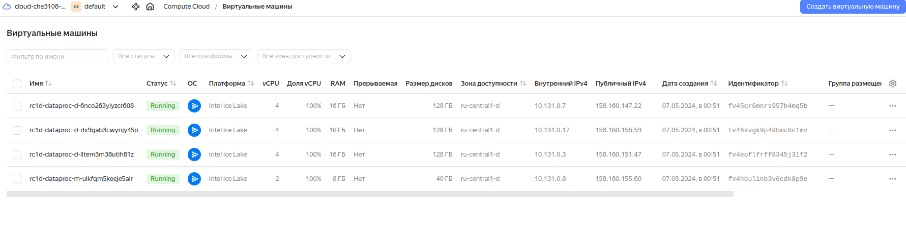
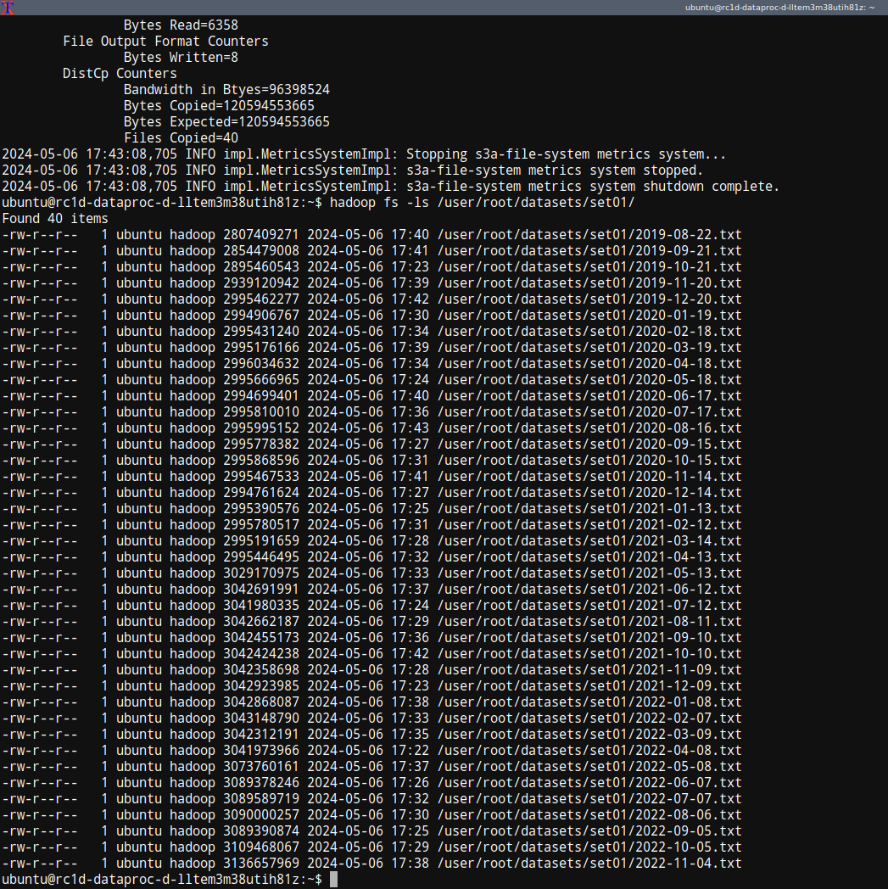

# Занятие №1
Первое занятие посвящено целям и метрикам.
По сути пересказ вот [этой](https://habr.com/ru/companies/ods/articles/328372/) статьи на хабре.

# Занятие №2
Занятие посвящено чистому коду, организации DS-проекта в целом, полезным инструментам.
1) на стадии выроботки первых концепций (EDA) применяются юпитер-ноутбуки. На этом этапе нет ни времени ни обоснованной необходимости задумываться над чистым кодом.
2) Данные собираются отдельно
3) на этапе перевода концепции в питон-код очищаем код максимально от всего (нотации типов, комменты, докстринги). проверяем линтером на соответствие стандартам написания, проверяем бандитом на косяки в безопасности и забытые секретные данные
4) есть инструменты для автоматического собра документации

# Занятие №3
Методология управления проектами (водопад, аджаил, скрам).
Рассматривались типовые методологии по управлению проектами, применяемые при разработке софта. Отдельно речь шла по вписании ds-специалиста в общую концепцию. 
Важным моментом является постановка задачи по методологии SMART. Важным это является потому, что методлогия SMART позволяет стандартизировать и типизировать поставку задачи как самому себе, так и команде. Втором важным моментом является канбан-доски как способ управления как личными, так и командными задачами. Github умеет в канбан-доски.

# Занятие №4
Занятие посвящено практическому применению канбан-досок и постановке задач по методу SMART. Отличительной особенностью занятия является онлайн разбор правильности формулировок постановок задач по методологии SMART.

## ДЗ к занятию №4
[Текст ДЗ](https://github.com/Che3108/my_otus/blob/main/MLops/%D0%94%D0%97_%D0%9F%D1%80%D0%B0%D0%BA%D1%82%D0%B8%D0%BA%D0%B0._%D0%A4%D0%BE%D1%80%D0%BC%D0%B8%D1%80%D0%BE%D0%B2%D0%B0%D0%BD%D0%B8%D0%B5_%D0%BF%D1%80%D0%BE%D1%86%D0%B5%D1%81%D1%81%D0%BE%D0%B2_%D0%BA%D0%BE%D0%BC%D0%B0%D0%BD%D0%B4%D1%8B-299428-9d683a.pdf)

### Мои комментарии (ход мыслей по поводу ДЗ)
Перед нами задача определени фрода (мошеннических операций). Сразу ясно, что:
1) Это <b>задача классфикации</b>;
2) Так как фрода в разы меньше чем обычных операций, то явный <b>огромный дисбаланс классов</b> (метрика accuracy отметается сразу же).

Из текста ДЗ понятно, что каждая выявленная мошенническая операция ухудшает лольность клиентов. Если процент таких операций превысит 5%, то начнется отток клиентов, что крайне не желательно. Однако, на мой личный взгляд, допущение проведения мошеннических операций приведет к еще большим последствиям. Как финансовым, так и репутационным. Вывод такой: необходимо максимально точно опеределить все мошеннические операции, а так же возможно допустимо назвать обычные операции фродом, но с отпеределенным приделом. Это значит, что ведущая метрика - <b>recall</b>. Именно она должна быть максимизирована (быть близка к 1). Однако, алгоритм может максимизировать recall путем называния всех 100% операций мошенническими, что явно недопустимо. Это значит, что для precision нужно задать какие-то рамки. 

Из текста ДЗ понятно, что в среднем есть 2% мошеннических операций из всего потока операций. А при 5% выявленных мошеннических операций начинается отток клиентов. Значит выявленные мошеннические операции должны быть в приделах от 2% до 5% от всего количества операций. Исходя из этой информации посчитаем нижние границы метрик для будущего прототипа на примере пиковой нагрузки в 400 операций в секунду.

Количесво мошеннических операций: 400 * 0.02 = 8 
Вводим допущение, что 1 из 8 фактических мошеннических операций алгоритм упустил (мы же говорим о прототипе). 
Максимальное число операций, которые можно назвать мошенническими до начала оттока клиентов: 400 * 0.05 = 20 
Максимально число операций, которые можно назвать фродом, но по факту не являются фродом: 20 - 7 = 13 
Таким образом собираем матрицу ошибок классфикации для наихудшего варианта алгоритма по опеределению фрода (эта же матрица является нижней границей):
|  | y_true = 1 | y_true = 0 |
| ---: | :---: | :---: |
| y_pred = 1 | 7 | 13 |
| y_pred = 0 | 1 | 379 |

Откуда: 
Наихудший recall = 7 / (7 + 1) = 0.875 $\approx$ 0.9 
Наихудший precision = 7 / (7 + 13) = 0.35 $\approx$ 0.4 

Итого формируем цель на прототип антифрод-системы: 
<b>Для снижения финансовых и репутационных рисков, а так же осуществления конкурентоспособности, необходимо за 3 месяца разработать и протестировать прототип антифрод-системы, выявляющий не менее 90% фактических мошеннических операций, при этом количество ложно-положительных сигналов должно составлять не более 60% от общего количесва положительных сигналов.</b>

# Занятие №11
## ДЗ к занятию №11

1) Точка доступа к бакиту s3://cherepanov-bucket
2) 
3) 
